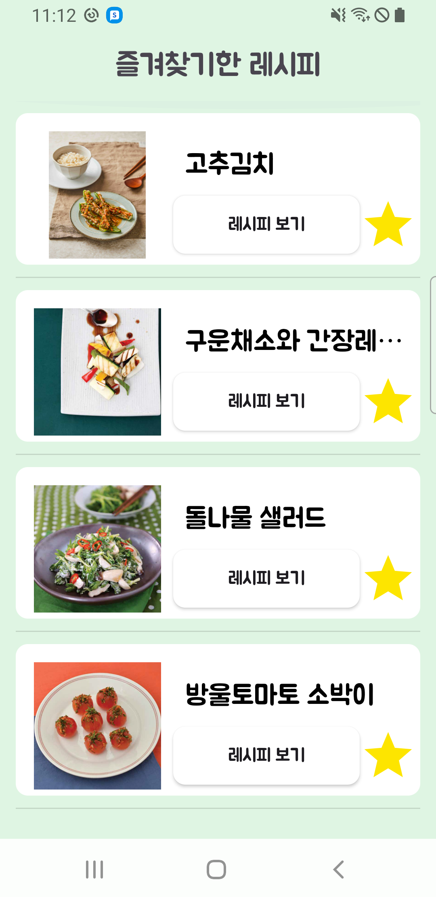

# Project Name : Chef-s-Note

## 설명
이 프로젝트는 **식품의약안전처 공공데이터활용서비스**의 **조리식품 레시피 DB** OpenAPI를 활용하여, 다양한 카테고리의 음식 레시피와 레시피 사진을 제공하는 앱입니다. 사용자는 **밥, 국, 반찬, 고급 음식, 디저트** 등의 카테고리에서 다양한 레시피를 손쉽게 찾고, 관련 이미지를 확인할 수 있습니다.
<br> <br>

## 기능

- **음식 레시피 조회**: 밥, 국, 반찬, 고급 음식, 디저트 카테고리의 레시피를 검색하여 조회 가능
- **레시피 이미지 제공**: 각 레시피에 대한 관련 이미지 제공
- **검색 기능**: 음식명으로 레시피 검색 기능 제공
- **즐겨찾기 기능**: 마음에 드는 레시피를 즐겨찾기에 추가하여, 나중에 쉽게 다시 확인 가능
<br> <br>

## 기술 스택

- **언어 (Languages)**: Java, XML
- **도구 (Tools)**: Android Studio
- **라이브러리 (Libraries)**: Android SDK, Glide, Retrofit, Room
- **기술 적용**:
  - **Retrofit**: **식품의약안전처 공공데이터활용서비스**의 조리식품 레시피 DB OpenAPI와의 통신을 통해 다양한 카테고리의 레시피 및 관련 이미지 조회.
  - **Glide**: 레시피 이미지 로딩 및 표시 최적화, 빠르고 효율적인 이미지 처리.
  - **Room**: 로컬 데이터베이스 사용, 즐겨찾기 레시피 저장 및 관리.
  - **RecyclerView**: 유연하고 효율적인 리스트 구현, 레시피 목록 및 즐겨찾기 목록 표시.

<br> <br>

## 프로젝트 진행 중 새롭게 배운 것 

### 1. **Room DB에 리스트 데이터를 저장할 때의 JSON ↔ ArrayList 변환**
Room DB에서 리스트 데이터를 저장할 때, **JSON 형식으로 변환하여 저장**하고, 다시 **ArrayList 형태로 변환해 사용하는 방법**을 알게되었습니다.
이를 위해**Converters 클래스**를 활용하여 데이터를 변환할 수 있도록 설정했습니다.
이 방법은 복잡한 데이터 구조를 다룰 때 유용하며, 데이터를 보다 효율적으로 관리하는 데 도움이 됩니다.

*Converters 클래스*
```java
public class Converters {
    private static Gson gson = new Gson();

    @TypeConverter
    public static String fromList(ArrayList<String> list) {
        return gson.toJson(list);  // 리스트 → JSON 문자열 변환
    }

    @TypeConverter
    public static ArrayList<String> toList(String json) {
        Type listType = new TypeToken<ArrayList<String>>() {}.getType();
        return gson.fromJson(json, listType);  // JSON 문자열 → 리스트 변환
    }
}
```

<br> <br>
  
## Screenshots

### 메인화면


- **밥**, **국**, **반찬**, **고급 음식**, **디저트**의 요리 카테고리를 제공합니다. <br> 또한, 원하는 음식을 검색하여 레시피를 쉽게 찾아볼 수도 있습니다.
<br><br>

### 요리 리스트 및 레시피 화면
<div style="display: flex; gap: 10px;">
    
    
  
</div>
<br><br>

### 즐겨찾기 기능
<div style="display: flex; gap: 10px;">
    
    
</div>
● 즐겨찾기 기능을 통해 마음에 드는 레시피를 빠르게 확인할 수 있습니다. <br>


